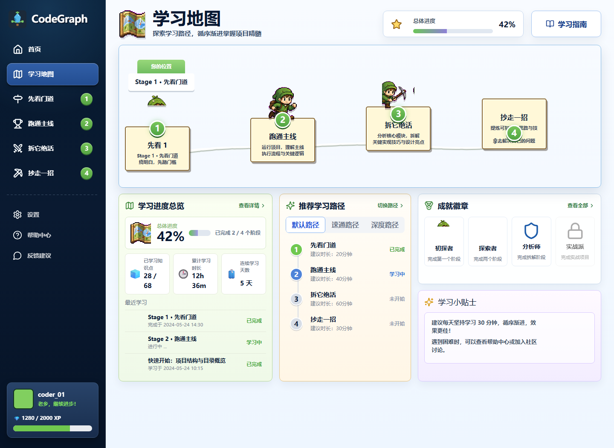
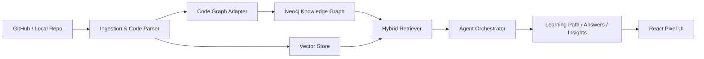

# CodeGraph

<div align="center">
  

  <p>
    <strong>把复杂 GitHub 仓库变成一条可探索、可提问、可复盘的代码学习路径。</strong>
  </p>

  <p>
    <a href="#在线-demo">在线 Demo</a> ·
    <a href="#界面预览">界面预览</a> ·
    <a href="#快速开始">快速开始</a> ·
    <a href="#系统架构">系统架构</a>
  </p>

  <p>
    
    
    
    
    
    
  </p>
</div>

## 项目简介

CodeGraph 是一个 **Multi-Agent 驱动的代码仓库学习平台**。它的核心不是简单的 RAG 问答，而是通过多智能体协作，将复杂仓库拆解为结构化的学习路径。

### 为什么是 Agent，而非传统 RAG？

| 维度 | 传统 RAG | CodeGraph Multi-Agent |
| --- | --- | --- |
| **工作流** | Query → 检索 → 生成答案 | Query → **规划** → **工具选择** → **执行** → **反思** → **上下文传递** |
| **协作** | 单轮问答，无状态 | 4-stage 编排，显式上下文传递 |
| **并行** | 无 | MainFlow + Showcase 并行执行 |
| **容错** | 失败即停止 | 错误隔离，降级继续 |
| **可观测** | 黑盒 | 完整 trace 记录（工具调用 + 推理过程） |

### Agent 系统架构

```
                    ┌─────────────────┐
                    │ Orchestrator    │
                    │ (协调 4 阶段)    │
                    └────────┬────────┘
                             │
            ┌────────────────┼────────────────┐
            ▼                ▼                ▼
    ┌──────────────┐  ┌──────────────┐  ┌──────────────┐
    │ OverviewAgent│  │ MainFlowAgent│  │ ShowcaseAgent│
    │ (先看门道)    │  │ (跑通主线)    │  │ (拆它绝活)    │
    └──────┬───────┘  └──────┬───────┘  └──────┬───────┘
           │                 │ parallel         │
           └─────────────────┴──────────────────┘
                             │ context pass
                             ▼
                    ┌──────────────┐
                    │ TakeawayAgent│
                    │ (抄走一招)    │
                    └──────────────┘
                             │
                             ▼
                    ┌──────────────┐
                    │ 15+ Tools    │
                    │ (架构检测/调用 │
                    │  图追踪/模式   │
                    │  匹配...)     │
                    └──────────────┘
```

**核心特性：**
- **显式编排**：OverviewAgent 先建立全局认知，输出作为下游 agent 输入
- **并行执行**：MainFlow 和 Showcase 同时分析，节省等待时间
- **上下文传递**：`architectureSummary` → `flowNodes` → `highlights` 流式传递
- **工具生态**：15+ 专用工具（非通用 LangChain tools），领域适配
- **失败隔离**：单个 stage 失败不阻塞其他 stage，输出降级为 error stub

你可以把它理解成”代码仓库导游”：输入一个 GitHub 仓库，系统会帮助你先建立全局认知，再跑通主线流程，之后拆解核心技巧，最后沉淀成可迁移的方法。

## 在线 Demo

推荐使用 **Vercel 部署前端静态 Demo**，这是最适合长期放在 README 里的方式：

```bash
cd frontend
npm install
npm run build
```

然后在 Vercel 创建项目，选择 `frontend` 作为 Root Directory：

| 配置项 | 值 |
| --- | --- |
| Framework Preset | Vite |
| Build Command | `npm run build` |
| Output Directory | `dist` |
| Root Directory | `frontend` |

`frontend/vercel.json` 已经配置了 SPA 路由回退，部署后 `/map`、`/overview`、`/mainflow` 等页面可以直接刷新访问。部署完成后，把下面链接替换为你的生产地址即可：

```md
[查看在线 Demo](https://你的项目名.vercel.app/)
```

如果希望 URL 长期稳定，建议绑定自定义域名，例如 `codegraph.your-domain.com`。这样即使迁移 Vercel 项目，README 里的链接也不用改。

## 界面预览

### 学习路径页

下面是真实网页截图，来自 `/map` 页面。



### 产品原型

这些原型图用于展示完整学习旅程的页面方向。学习路径页上方已经使用真实网页截图，因此这里不再用原型图替代它。

| 首页 | 先看门道 |
| --- | --- |
|  |  |

| 跑通主线 | 拆它绝活 |
| --- | --- |
|  |  |

| 抄走一招 |
| --- |
|  |

## 核心能力

| 能力 | 说明 |
| --- | --- |
| **Multi-Agent 编排** | 4-stage agent 协作：Overview → MainFlow/Showcase (parallel) → Takeaway，显式上下文传递 |
| **工具生态** | 15+ 专用工具：架构检测、调用图追踪、模式匹配、测试关联、README 摘要等 |
| **并行执行** | MainFlow 和 Showcase 并行分析，单 agent 失败不阻塞其他 agent |
| **Trace 可观测** | 记录每个 agent 的推理过程、工具调用、输入输出和执行时间 |
| **图增强 RAG** | 结合图遍历、关键词检索和向量检索，让回答不只依赖相似文本，也能理解代码结构关系 |
| **学习路径生成** | 将复杂仓库拆成”先看门道、跑通主线、拆它绝活、抄走一招”四段学习路线 |
| **可视化学习** | 用像素风界面、学习地图、阶段卡片、成就徽章和进度系统降低进入复杂项目的心理成本 |
| **代码问答** | 面向仓库上下文提问，辅助定位模块职责、执行路径、关键模式和可复用思路 |

## 学习路径设计

1. **先看门道**  
   快速理解项目定位、目录结构、技术栈、关键模块和整体架构。

2. **跑通主线**  
   找到项目的核心入口、执行流程和关键调用链，知道系统是如何运转起来的。

3. **拆它绝活**  
   分析值得学习的实现模式、抽象设计、工程技巧和关键权衡。

4. **抄走一招**  
   把学到的模式转化为可复用的实践卡片，帮助迁移到自己的项目中。

## 系统架构



### 后端

- FastAPI 提供 API 与 WebSocket 能力
- Neo4j 存储代码实体、依赖、调用链和概念关系
- 向量检索与关键词检索负责补充语义召回
- 多个 Analyzer / Stage Agent 负责生成阶段化学习内容

### 前端

- React 18 + TypeScript + Vite
- React Router 管理学习页、分析页和阶段页
- Mantine + 自定义像素风组件构建交互界面
- Framer Motion、Lucide React、React Flow / D3 支撑动效和可视化

## 快速开始

### 环境要求

- Python 3.11+
- Node.js 18+
- Docker 与 Docker Compose
- Neo4j / Redis 等基础服务
- OpenAI 兼容模型 API Key

### 1. 克隆项目

```bash
git clone https://github.com/liu66-qing/CodeGraph.git
cd CodeGraph
```

### 2. 配置环境变量

```bash
cp .env.example .env
```

根据你的模型服务、数据库和缓存服务配置 `.env`。

### 3. 启动基础服务

```bash
docker-compose up -d
```

### 4. 启动后端

```bash
pip install -e ".[dev]"
uvicorn evograph.main:app --reload --host 0.0.0.0 --port 8000
```

### 5. 启动前端

```bash
cd frontend
npm install
npm run dev
```

访问 `http://localhost:5173`。如果端口被占用，Vite 会自动切换到下一个可用端口。

## 常用命令

| 命令 | 说明 |
| --- | --- |
| `npm run dev` | 启动前端开发服务 |
| `npm run build` | 构建前端生产包 |
| `uvicorn evograph.main:app --reload --port 8000` | 启动后端 API |
| `pytest` | 运行测试 |
| `ruff check .` | 检查 Python 代码风格 |

## 目录结构

```text
.
├── frontend/              # React + Vite 前端
├── src/evograph/          # FastAPI、Agent、RAG、图谱与解析核心
├── tests/                 # 单元测试与集成测试
├── docs/                  # 产品方案、设计原型和 README 素材
├── alembic/               # 数据库迁移
├── docker-compose.yml     # 本地基础服务编排
└── pyproject.toml         # Python 项目配置
```

## 适合谁使用

- 想快速读懂大型开源项目的学习者
- 想为团队沉淀代码学习路径的技术负责人
- 想构建代码仓库问答、代码知识图谱、工程学习助手的开发者
- 想研究 Graph RAG 与 Agentic workflow 在代码理解场景中落地方式的人

## 路线图

- [ ] 增强多语言代码解析能力
- [ ] 增加更多仓库分析模板
- [ ] 支持 GitHub App / OAuth 工作流
- [ ] 完善图谱可视化与调用链追踪
- [ ] 增加可导出的学习报告和团队学习看板

## License

本项目使用 Apache-2.0 License，详见 [LICENSE](./LICENSE)。

