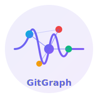
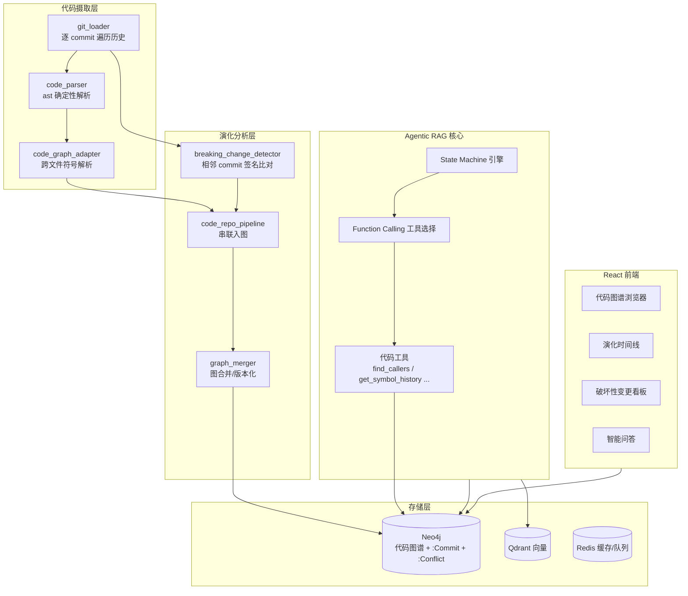

<p align="center">
  
</p>

<h1 align="center">GitGraph</h1>
<h3 align="center">基于 Agentic RAG 的代码演化分析引擎</h3>

<p align="center">
  <em>把时序知识图谱接到 git 历史，自动定位"破坏性变更"——静态分析工具做不到的事。</em>
</p>

<p align="center">
  <a href="#"></a>
  <a href="#"></a>
  <a href="#"></a>
  <a href="#"></a>
  <a href="#"></a>
</p>

<p align="center">
  <a href="#这是什么">这是什么</a> &bull;
  <a href="#核心差异化">核心差异化</a> &bull;
  <a href="#架构">架构</a> &bull;
  <a href="#快速开始">快速开始</a> &bull;
  <a href="#api-参考">API</a> &bull;
  <a href="#技术栈">技术栈</a>
</p>

---

## 这是什么

GitGraph 是一个 **Agentic RAG（智能体检索增强）代码分析引擎**。它不止于"对代码做问答"，而是把一整个 git 仓库的历史逐 commit 重建为**时序代码知识图谱**，从而回答静态工具回答不了的问题：

> **"哪一个 commit 改坏了这个函数的契约，而当时还有谁在调用它？"**

给定一个本地 git 仓库，GitGraph 会自动：

1. **确定性解析** —— 用 Python 内置 `ast` 把每份源码解析成 模块/类/函数/方法 节点 + `IMPORTS`/`CALLS`/`INHERITS`/`DEFINES` 边（零 LLM、可复现、精确）。
2. **逐 commit 重建** —— 沿 git 历史回放，为每个时间点重建当时的代码图谱（时序版本化）。
3. **破坏性变更检测** —— 按 `parent_sha` 比对相邻 commit 的函数签名，检测 **签名变更 / 必填参数新增 / 函数删除**，且仅当被改符号**仍被调用**时才判定为破坏性（高信号、低噪声）。
4. **图谱入库** —— 复用图合并器把代码图谱写入 Neo4j，破坏性变更存为链到 `:Commit` 的 `:Conflict` 节点。
5. **Agent 问答** —— 通过 Function Calling 暴露 `find_callers` / `find_dependencies` / `get_symbol_history` / `find_breaking_changes` 等代码工具。
6. **可视化** —— 代码图谱、演化时间线、破坏性变更看板。


---

<a name="核心差异化"></a>
## 核心差异化

主流代码图谱/静态分析工具（如 GitNexus 一类）只看**单一快照**：当前代码长什么样、谁调用谁。GitGraph 多了一个维度——**时间**。

```
静态分析：  仓库当前状态  ──►  "X 调用了 Y"
                                （一张静态图）

GitGraph：  commit₁ → commit₂ → … → commitₙ  ──►  "commit₄7 把 get_user 的签名改了，
            （每个 commit 一张图，按 parent 串联）      而 service.load 当时还在调它 —— 破坏性"
```

**为什么"仍被调用"这个条件是关键**：一个没人调用的函数改签名、被删除，都无所谓。只有当契约变更**击中实际依赖方**时才是真正的风险。GitGraph 用这一条把噪声压到最低——它报出来的每一条，都是值得人看的。

### 破坏性变更的三种类型

| 类型 | 触发条件 | 示例 |
|------|---------|------|
| `REQUIRED_PARAM_ADDED` | 新增必填参数，老调用方会少传参 | `get_user(uid)` → `get_user(uid, tenant)` |
| `SIGNATURE_CHANGED` | 签名变更（且仍被调用） | 参数改名/改顺序/类型注解变动 |
| `SYMBOL_REMOVED` | 函数被删除，但仍有调用方引用 | 删了 `util.fmt`，而 `legacy.old` 还在调 |

### 降噪策略
- 仅当**新快照**中仍存在调用方时才判定签名变更为破坏性。
- 删除检测会先看同名可调用符号是否在别处仍然存在——若存在，判定为"移动/重写"而非"删除"，避免文件改名误报。
- 按 `parent_sha` 而非时间顺序比对，正确处理**非线性历史**（合并、多根 commit）——时间相邻但不在同一分支的 commit 不会产生巨量虚假 diff。


---

<a name="架构"></a>
## 架构



### 核心数据流

```
本地 git 仓库
    │  git_loader: ls-tree 拿 (blob_sha, path) + cat-file --batch 批量读
    ▼
逐 commit 快照（blob 缓存：未改动文件全程只解析一次）
    │  code_parser: ast → 模块/类/函数/方法 节点 + 4 类边
    ▼
每个 commit 的代码图谱（ParseResult 列表）
    │  ├─ code_graph_adapter: 跨文件解析 self./裸名/点号调用 → 入图
    │  └─ breaking_change_detector: 按 parent_sha 比对相邻快照
    ▼
Neo4j：:Entity（代码符号，带 repo_id）+ RELATION 边
       :Commit（带 PARENT 链、符号/文件计数）
       :Conflict（破坏性变更，链到引入它的 :Commit + 受影响 :Entity）
```


---

<a name="快速开始"></a>
## 快速开始

### 环境要求
- Python 3.11+
- Node.js 18+
- Docker & Docker Compose（用于本地起 Neo4j / Qdrant / Redis / PostgreSQL）

### 1. 克隆与配置

```bash
git clone https://github.com/liu66-qing/GitGraph.git
cd GitGraph
cp .env.example .env
# 编辑 .env，填入你的密钥：
#   LLM_API_KEY=<你的 DeepSeek key>
#   EMBED_API_KEY=<你的 DashScope key>
```

### 2. 起基础设施

```bash
docker compose up -d   # Neo4j + Qdrant + Redis + PostgreSQL
```

### 3. 装依赖并启动后端

```bash
pip install -e ".[dev]"
make run                # uvicorn，监听 :8080
make worker             # 另开一个终端，跑 Celery 异步任务
```

### 4. 启动前端

```bash
cd frontend && npm install && npm run dev
```

打开 http://localhost:5173 。前端采用 **API 优先 + 优雅降级**：后端未连接时自动回退到"工具分析自身结构"的代码语义示例数据，演示永不空屏。

### 5. 分析一个仓库

```bash
# 触发对一个本地 git 仓库的异步分析
curl -X POST http://localhost:8080/api/v1/repositories \
  -H "Content-Type: application/json" \
  -d '{"repo_path": "/abs/path/to/some/repo", "repo_id": "demo"}'

# 查看检测到的破坏性变更
curl http://localhost:8080/api/v1/repositories/demo/breaking-changes
```

> 建议用一个干净的开源仓库（如 `requests`）做演示，效果最佳。


---

<a name="api-参考"></a>
## API 参考

后端启动后，完整 Swagger 文档见 `http://localhost:8080/docs`。

### 代码仓库分析（核心）

| 方法 | 端点 | 说明 |
|------|------|------|
| `POST` | `/api/v1/repositories` | 分析本地 git 仓库（异步），返回 `repo_id` |
| `GET` | `/api/v1/repositories` | 列出已分析的仓库 |
| `GET` | `/api/v1/repositories/{repo_id}/graph` | 代码图谱 nodes + edges（按 repo 过滤） |
| `GET` | `/api/v1/repositories/{repo_id}/commits` | commit 时间线（含符号/文件计数、破坏性变更标记） |
| `GET` | `/api/v1/repositories/{repo_id}/breaking-changes` | 检测到的破坏性变更 |
| `GET` | `/api/v1/repositories/{repo_id}/stats` | 节点/关系/commit/破坏性变更计数 |

### 图谱 / 问答 / 冲突

| 方法 | 端点 | 说明 |
|------|------|------|
| `POST` | `/api/v1/query` | 智能问答（含推理轨迹） |
| `POST` | `/api/v1/query/stream` | SSE 流式问答 |
| `GET` | `/api/v1/graph/entities` | 按名称搜索实体 |
| `GET` | `/api/v1/graph/entities/{id}/neighborhood` | N 跳子图 |
| `GET` | `/api/v1/conflicts` | 列出冲突（破坏性变更也走这里） |

### Agent 代码工具

通过 Function Calling 暴露给智能体的工具：

| 工具 | 作用 |
|------|------|
| `find_callers` | 找出谁调用了某个符号 |
| `find_dependencies` | 找出某个符号依赖什么 |
| `get_symbol_history` | 追踪一个符号跨 commit 的演化 |
| `find_breaking_changes` | 列出某个仓库的破坏性变更 |

---

<a name="技术栈"></a>
## 技术栈

| 层 | 技术 | 用途 |
|----|------|------|
| **后端** | Python 3.11、FastAPI、Celery | 异步 API + 任务处理 |
| **代码解析** | Python 内置 `ast` | 确定性代码图谱构建（零 LLM） |
| **LLM** | DeepSeek（OpenAI 兼容） | Agent 推理、问答合成 |
| **Embedding** | DashScope text-embedding-v3（1024 维） | 语义向量检索 |
| **图数据库** | Neo4j 5.x | 代码图谱存储与遍历 |
| **向量库** | Qdrant | 语义相似检索 |
| **缓存/队列** | Redis 7 | 缓存、Celery broker、pub/sub |
| **关系库** | PostgreSQL 16 | 元数据 |
| **前端** | React 18、TypeScript、Vite | 用户界面 |
| **可视化** | D3.js | 力导向代码图谱 |
| **样式** | TailwindCSS | 响应式 UI |
| **可观测性** | structlog、OpenTelemetry | 结构化日志与链路追踪 |

---

## 项目结构

```
GitGraph/
├── src/evograph/
│   ├── ingestion/                   # 代码摄取
│   │   ├── git_loader.py            # 逐 commit 遍历 + blob 缓存 + cat-file 批量读
│   │   ├── code_parser.py           # ast 确定性解析器
│   │   └── code_graph_adapter.py    # 跨文件符号解析 → 复用 merger 入图
│   ├── evolution/                   # 演化分析
│   │   ├── breaking_change_detector.py  # 破坏性变更检测（核心差异化）
│   │   ├── code_repo_pipeline.py    # 串联 git→解析→入图→commit 链
│   │   └── merger.py                # 图合并 / 版本化
│   ├── agent/                       # Agentic RAG 核心
│   │   ├── engine.py                # State Machine + Function Calling
│   │   └── tools/registry.py        # 代码工具注册表
│   ├── graph/                       # Neo4j 客户端与遍历
│   ├── retrieval/                   # 混合检索（向量 + 图 + 关键词）
│   ├── tasks/                       # Celery 异步任务
│   ├── models/domain.py             # 实体/关系/冲突领域模型
│   └── api/v1/                      # REST 端点
│       └── repositories.py          # 代码仓库分析端点
├── frontend/                        # React + D3.js 前端
│   └── src/pages/
│       ├── GraphExplorer.tsx        # 代码图谱浏览器
│       ├── Timeline.tsx             # 演化时间线
│       └── ConflictDashboard.tsx    # 破坏性变更看板
├── tests/                           # 单元 / 集成测试
├── docker-compose.yml               # Neo4j + Qdrant + Redis + PostgreSQL
└── docs/                            # 文档与素材
```

---

## 设计取舍

- **确定性解析 vs LLM 抽取**：代码结构用 `ast` 确定性解析——快、可复现、精确，不烧 token、不产生幻觉。LLM 只用在自然语言问答这一层。
- **复用而非重写**：代码图谱复用文档管线已有的 `GraphMerger` / Neo4j 模型 / 冲突存储，破坏性变更直接落到既有的 `:Conflict` 通道，前端冲突看板与 API 无需另起炉灶。
- **性能**：`git_loader` 用 `git cat-file --batch` 把"每文件一次 `git show`"压成"每 commit 一次批量读"，并按 `(blob_sha, path)` 缓存 `ParseResult`——未改动文件全程只解析一次，复杂度从 `O(commits × files)` 降到 `O(distinct file versions)`。

---

## 贡献

1. Fork 本仓库
2. 新建特性分支（`git checkout -b feature/your-feature`）
3. 跑测试（`make test`）
4. 提交改动并发起 Pull Request

---

## 许可证

本项目基于 Apache License 2.0 —— 详见 [LICENSE](LICENSE)。


