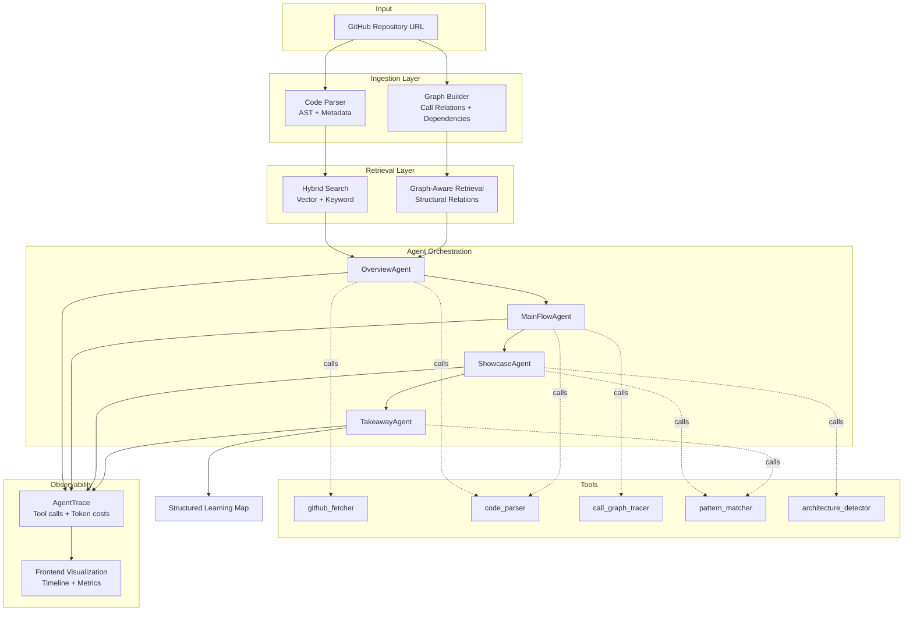

# CodeGraph

<div align="center">
  

  <h3>A multi-agent system that turns complex repositories into guided learning paths</h3>

  <p>
    <a href="./README.md">English</a> · <a href="./README.zh.md">中文</a> · <a href="https://code-graph-five.vercel.app/" target="_blank">Live Demo</a>
  </p>

  <p>
    
    
    
    
    
    
  </p>
</div>

---

## The Problem

You want to learn from `react`, `vscode`, or `langchain` — understand how they're built, what makes their design good. You open the repository. 2,000+ files. The README tells you how to *install* the project, not how to *understand* it.

You're stuck with these questions:

- Where's the entry point?
- How does the main execution flow work?
- Which modules actually matter?
- What design patterns are worth learning?
- How do I go from "confused" to "I actually get it"?

Traditional code search gives you fragments. ChatGPT gives you plausible-sounding answers with no structure. You need a map.

---

## The Solution

**CodeGraph is a multi-agent orchestration system that analyzes repositories through four specialized agents**, each with distinct responsibilities, tools, and structured outputs.

Instead of a single chatbot that tries to answer everything, CodeGraph coordinates four agents that work sequentially:

1. **OverviewAgent** — Understands the repo's positioning, tech stack, and architecture
2. **MainFlowAgent** — Traces the core execution path with call graph analysis
3. **ShowcaseAgent** — Identifies design patterns and implementation highlights
4. **TakeawayAgent** — Extracts reusable patterns you can apply to your own projects

Each agent uses deterministic tools (AST parsing, call tracing, dependency analysis) combined with LLM reasoning. Every tool call and LLM interaction is traced for full observability.

> 🎯 **[Try the Live Demo](https://code-graph-five.vercel.app/)** — The hosted demo showcases the frontend learning map interface. Full agent workflows with graph-aware retrieval run through the backend (requires local setup).

---

## How It Works

| Agent | Responsibility | Tools Used | Output |
|-------|---------------|------------|--------|
| **OverviewAgent** | Build mental model of the repo | `github_fetcher`, `code_parser`, `readme_summarizer` | Positioning, tech stack, architecture summary, reading order |
| **MainFlowAgent** | Trace main execution flow | `call_graph_tracer`, `code_parser`, `github_fetcher` | Execution flow diagram with clickable nodes and code evidence |
| **ShowcaseAgent** | Find design highlights | `pattern_matcher`, `architecture_detector`, `code_parser` | 3 design tricks with problem/solution/tradeoff/code links |
| **TakeawayAgent** | Extract reusable patterns | All previous outputs + `pattern_matcher` | 3 reusable patterns with implementation snippets and applicability guidance |

Each agent:
- Receives context from the previous agent's output
- Calls tools through a unified `call_tool()` interface (auto-traced)
- Returns structured JSON validated against a schema
- Records all tool calls, LLM requests, token costs, and latency

---

## Architecture



**Key architectural decisions:**

- **Agent separation of concerns**: Each agent owns one stage of understanding (overview → flow → highlights → takeaways), not a general-purpose "answer any question" interface.
- **Tool-based execution**: Agents don't hardcode analysis logic. They compose tools (`call_graph_tracer`, `pattern_matcher`) registered at initialization.
- **Graph-aware retrieval**: Combines semantic search with code structure (imports, calls, inheritance) — not just vector similarity.
- **Observable by default**: Every `call_tool()` and `call_llm()` automatically records trace data (args, results, latency, tokens). The frontend visualizes agent execution timelines.

---

## Why Multi-Agent Orchestration?

Most code understanding tools take one of two approaches:

### Approach 1: Traditional RAG
```
Chunk code → Embed → Retrieve similar → Generate answer
```
**Problem**: Misses code structure. No understanding of call chains, module boundaries, or architectural patterns.

### Approach 2: General chatbot
```
Paste repo context → Ask questions → Get answers
```
**Problem**: No systematic analysis. Answers are reactive, not structured. No staged progression from "what is this" to "how to use this."

### CodeGraph's approach: Multi-Agent Orchestration
```
Overview → MainFlow → Showcase → Takeaway
(Each agent uses tools + prior context)
```

| Capability | Traditional RAG | Chatbot | CodeGraph |
|------------|----------------|---------|-----------|
| Systematic repo analysis | ❌ | ❌ | ✅ 4-stage workflow |
| Call graph tracing | ❌ | ⚠️ Depends on prompt | ✅ Dedicated tool + agent |
| Structured outputs | ⚠️ Schema possible | ❌ Free text | ✅ JSON schema enforced |
| Agent specialization | ❌ Single model | ❌ Single model | ✅ 4 specialized agents |
| Full observability | ❌ | ❌ | ✅ Tool trace + token metrics |
| Graph-aware retrieval | ❌ Vector only | ❌ Context only | ✅ Vector + code relations |

**The key insight**: Understanding a codebase is not a single-turn Q&A task. It's a multi-stage workflow where each stage builds on the previous one. Each agent receives context from prior agents and contributes structured knowledge to the next.

---

## Tech Stack

| Layer | Technology |
|-------|-----------|
| **Frontend** | React, TypeScript, Vite, Mantine UI, Pixel-style design system |
| **Backend** | FastAPI, Python 3.11, async/await throughout |
| **Agent System** | Custom orchestrator, `BaseAgent` abstraction, tool registration |
| **Retrieval** | Hybrid search (vector + keyword), graph-aware ranking |
| **Graph** | Code relationship modeling (calls, imports, dependencies) |
| **Parsing** | Tree-sitter for multi-language AST parsing |
| **LLM** | OpenAI-compatible API (configurable: GPT-4, DeepSeek, etc.) |
| **Observability** | `AgentTrace`, `ToolCall` logging, frontend visualization |
| **Deployment** | Docker Compose (local infra), Vercel (frontend) |

---

## Screenshots

### Home


### Learning Map


### Stage Pages

<table>
  <tr>
    <td width="50%">
      
      <p align="center"><strong>① Overview</strong> — Positioning, architecture, mental model</p>
    </td>
    <td width="50%">
      
      <p align="center"><strong>② Main Flow</strong> — Execution trace with call graph</p>
    </td>
  </tr>
  <tr>
    <td width="50%">
      
      <p align="center"><strong>③ Showcase</strong> — Design highlights and patterns</p>
    </td>
    <td width="50%">
      
      <p align="center"><strong>④ Takeaway</strong> — Reusable patterns and code templates</p>
    </td>
  </tr>
</table>

---

## Quick Start

### Requirements

- Python 3.11+
- Node.js 18+
- Docker and Docker Compose
- OpenAI-compatible API key

### 1. Clone the repository

```bash
git clone https://github.com/liu66-qing/CodeGraph.git
cd CodeGraph
```

### 2. Configure environment

```bash
cp .env.example .env
```

Edit `.env` with your API keys and service configuration:

```env
# LLM Configuration
OPENAI_API_KEY=your_api_key_here
OPENAI_BASE_URL=https://api.openai.com/v1  # Or DeepSeek, etc.

# Database & Cache
NEO4J_URI=bolt://localhost:7687
REDIS_URL=redis://localhost:6379
```

### 3. Start infrastructure services

```bash
docker-compose up -d
```

This starts Neo4j (graph database) and Redis (cache).

### 4. Start backend

```bash
pip install -e ".[dev]"
uvicorn codegraph.main:app --reload --host 0.0.0.0 --port 8000
```

Backend runs at `http://localhost:8000`. API docs at `http://localhost:8000/docs`.

### 5. Start frontend

```bash
cd frontend
npm install
npm run dev
```

Frontend runs at `http://localhost:5173`.

---

## Project Structure

```
.
├── frontend/                  # React + Vite frontend
│   ├── src/
│   │   ├── components/        # Reusable UI components
│   │   ├── pages/             # 4 stage pages + home + learning map
│   │   ├── i18n/              # EN/ZH language dictionaries
│   │   └── assets/pixel/      # Pixel-art design assets
├── src/codegraph/             # Python backend
│   ├── agent/
│   │   ├── base.py            # BaseAgent, AgentTrace, ToolCall
│   │   ├── stages/            # OverviewAgent, MainFlowAgent, etc.
│   │   ├── tools/             # github_fetcher, code_parser, etc.
│   │   └── orchestrator.py    # Agent coordination logic
│   ├── retrieval/             # Hybrid + graph-aware retrieval
│   ├── graph/                 # Code relationship modeling
│   ├── parsers/               # Tree-sitter AST parsing
│   └── main.py                # FastAPI application
├── tests/                     # Unit and integration tests
├── docs/                      # Design docs, PRD, screenshots
└── docker-compose.yml         # Local infrastructure
```

---

## Roadmap

- [ ] Enhanced call graph accuracy for large TypeScript/Python repos
- [ ] Multi-file pattern detection (e.g., middleware chains across files)
- [ ] GitHub issue/PR context integration
- [ ] Export learning maps as Markdown or PDF
- [ ] Public backend deployment for full end-to-end hosted demo
- [ ] Example analyses for popular repos (React, FastAPI, LangChain)

---

## Contributing

CodeGraph is early-stage and welcomes contributions.

**How to contribute:**

- ⭐ **Star the repo** if the multi-agent approach resonates with you
- 🐛 **Open issues** for bugs or repos that don't analyze well
- 💡 **Suggest improvements** to agent prompts, tools, or architectures
- 🔧 **Submit PRs** for new language parsers, analysis tools, or UI improvements

**Good first issues:**

- Add support for Rust/Go/Java AST parsing
- Improve call flow extraction for async/await heavy codebases
- Add a sample analysis for a popular repo (Next.js, Vue, etc.)
- Export agent analysis results as structured Markdown

---

## License

Apache-2.0. See [LICENSE](./LICENSE).

---

<div align="center">
  <strong>If CodeGraph helps you understand one complex repo faster, please leave a star.</strong>
  <br>
  <sub>Stars tell me this approach is worth building further.</sub>
</div>

