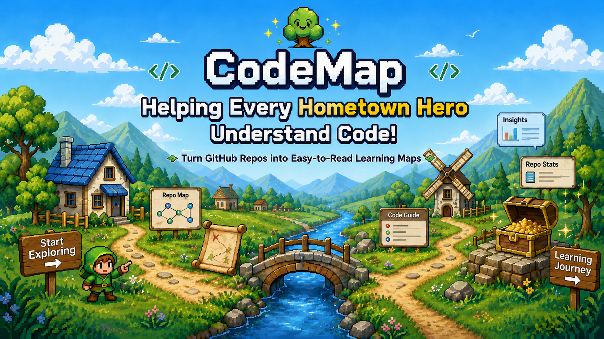
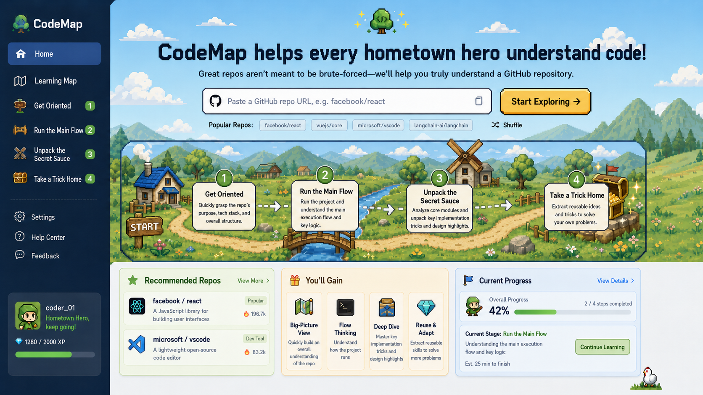

# CodeMap

<div align="center">
  

  <h3>A production-grade multi-agent system with memory hierarchy, adaptive execution, and guardrails</h3>

  <p>
    <a href="./README.md">English</a> · <a href="./README.zh.md">中文</a> · <a href="https://code-graph-five.vercel.app/" target="_blank">Live Demo</a>
  </p>

  <p>
    
    
    
    
    
    
    
  </p>
</div>

---

## The Problem

You want to learn from `react`, `vscode`, or `langchain` — understand how they're built, what makes their design good. You open the repository. 2,000+ files. The README tells you how to *install* the project, not how to *understand* it.

You're stuck with these questions:

- Where's the entry point?
- How does the main execution flow work?
- Which modules actually matter?
- What design patterns are worth learning?
- How do I go from "confused" to "I actually get it"?

Traditional code search gives you fragments. ChatGPT gives you plausible-sounding answers with no structure. You need a map.

---

## The Solution

**CodeGraph is a multi-agent orchestration system that analyzes repositories through four specialized agents**, each with distinct responsibilities, tools, and structured outputs.

Instead of a single chatbot that tries to answer everything, CodeGraph coordinates four agents that work sequentially:

1. **OverviewAgent** — Understands the repo's positioning, tech stack, and architecture
2. **MainFlowAgent** — Traces the core execution path with call graph analysis
3. **ShowcaseAgent** — Identifies design patterns and implementation highlights
4. **TakeawayAgent** — Extracts reusable patterns you can apply to your own projects

Each agent uses deterministic tools (AST parsing, call tracing, dependency analysis) combined with LLM reasoning. Every tool call and LLM interaction is traced for full observability.

> 🎯 **[Try the Live Demo](https://code-graph-five.vercel.app/)** — The hosted demo showcases the frontend learning map interface. Full agent workflows with graph-aware retrieval run through the backend (requires local setup).

---

## How It Works

| Agent | Responsibility | Tools Used | Output |
|-------|---------------|------------|--------|
| **OverviewAgent** | Build mental model of the repo | `github_fetcher`, `code_parser`, `readme_summarizer` | Positioning, tech stack, architecture summary, reading order |
| **MainFlowAgent** | Trace main execution flow | `call_graph_tracer`, `code_parser`, `github_fetcher` | Execution flow diagram with clickable nodes and code evidence |
| **ShowcaseAgent** | Find design highlights | `pattern_matcher`, `architecture_detector`, `code_parser` | 3 design tricks with problem/solution/tradeoff/code links |
| **TakeawayAgent** | Extract reusable patterns | All previous outputs + `pattern_matcher` | 3 reusable patterns with implementation snippets and applicability guidance |

Each agent:
- Receives context from the previous agent's output
- Calls tools through a unified `call_tool()` interface (auto-traced)
- Returns structured JSON validated against a schema
- Records all tool calls, LLM requests, token costs, and latency

---

## Architecture

```
┌─────────────────────────────────────────────────────────────────────────────┐
│                          CodeMap Agent System                                 │
├─────────────────────────────────────────────────────────────────────────────┤
│                                                                              │
│  ┌─────────────┐   ┌─────────────────────────────────────────────────────┐  │
│  │   Session    │   │              Agent Orchestration                     │  │
│  │  Manager     │   │                                                     │  │
│  │             │   │  ┌──────────┐  ┌──────────┐  ┌──────────┐          │  │
│  │ • State FSM │   │  │ Overview │  │ MainFlow │  │ Showcase │  → ...   │  │
│  │ • Fork      │   │  │  Agent   │  │  Agent   │  │  Agent   │          │  │
│  │ • TTL       │   │  └────┬─────┘  └────┬─────┘  └────┬─────┘          │  │
│  └──────┬──────┘   │       │              │              │               │  │
│         │          │       ▼              ▼              ▼               │  │
│         │          │  ┌─────────────────────────────────────────────┐    │  │
│         │          │  │         Execution Mode Selector              │    │  │
│         │          │  │  simple query → ReAct | complex → Plan-Exec  │    │  │
│         │          │  └─────────────────────────────────────────────┘    │  │
│         │          └─────────────────────────────────────────────────────┘  │
│         │                                                                    │
│  ┌──────┴──────────────────────────────────────────────────────────────┐    │
│  │                    Memory Hierarchy                                   │    │
│  │                                                                      │    │
│  │  ┌─────────────┐  ┌─────────────────┐  ┌───────────────────────┐   │    │
│  │  │ Short-Term  │  │    Long-Term     │  │    Consolidation      │   │    │
│  │  │ (Working)   │  │   (Persistent)   │  │   (STM → LTM)        │   │    │
│  │  │             │  │                  │  │                       │   │    │
│  │  │ OrderedDict │  │ Qdrant + Redis   │  │ • Access frequency    │   │    │
│  │  │ ~4K tokens  │  │ Semantic search  │  │ • Priority escalation │   │    │
│  │  │ LRU evict   │  │ Vector retrieval │  │ • Entity-linked       │   │    │
│  │  └─────────────┘  └─────────────────┘  └───────────────────────┘   │    │
│  └─────────────────────────────────────────────────────────────────────┘    │
│                                                                              │
│  ┌──────────────────────────────────────────────────────────────────────┐   │
│  │                Multi-Agent Communication                              │   │
│  │                                                                       │   │
│  │  ┌──────────────┐  ┌──────────────────┐  ┌────────────────────┐     │   │
│  │  │ Message Bus  │  │  Shared State    │  │    Guardrails       │     │   │
│  │  │ (Pub/Sub)    │  │  (Blackboard)    │  │                    │     │   │
│  │  │              │  │                  │  │ • Loop detection    │     │   │
│  │  │ Redis Stream │  │ Optimistic CAS   │  │ • Drift detection   │     │   │
│  │  │ Topic route  │  │ Version control  │  │ • Token budget      │     │   │
│  │  │ Dead letter  │  │ Full snapshot    │  │ • Wall-clock cap    │     │   │
│  │  └──────────────┘  └──────────────────┘  └────────────────────┘     │   │
│  └──────────────────────────────────────────────────────────────────────┘   │
│                                                                              │
│  ┌──────────────────────────────┐  ┌────────────────────────────────────┐   │
│  │   Context Compression         │  │     Tool & Skill System            │   │
│  │                               │  │                                    │   │
│  │  Zone 1: Recent (verbatim)   │  │  • Dynamic loader (*_tool.py)     │   │
│  │  Zone 2: Middle (summary)    │  │  • JSON Schema validation         │   │
│  │  Zone 3: Distant (entities)  │  │  • Trigger-based skills           │   │
│  │                               │  │  • Invocation tracing             │   │
│  │  Trigger: 80% utilization    │  │  • Skill composition (DAG)        │   │
│  └──────────────────────────────┘  └────────────────────────────────────┘   │
│                                                                              │
│  ┌──────────────────────────────────────────────────────────────────────┐   │
│  │                    Infrastructure                                     │   │
│  │  Neo4j (graph) │ Qdrant (vectors) │ Redis (state) │ PostgreSQL (meta)│   │
│  └──────────────────────────────────────────────────────────────────────┘   │
└─────────────────────────────────────────────────────────────────────────────┘
```

**Key architectural decisions:**

| Decision | Choice | Why Not Alternative |
|----------|--------|-------------------|
| Memory storage (STM) | In-memory OrderedDict | Redis RTT (~50ms) unacceptable on hot path |
| Memory storage (LTM) | Qdrant + Redis | FAISS lacks persistence + filtering |
| Agent communication | Pub/Sub + Blackboard | Direct RPC creates coupling; blackboard enables crash recovery |
| Execution mode | Adaptive (ReAct/Plan-Exec) | Single mode either over-plans simple queries or under-plans complex ones |
| Context compression | Hybrid 3-zone | Single strategy trades off too much in one dimension |
| Loop prevention | Fingerprint + N-gram | Token-only budgets can't detect semantic repetition |
| Session persistence | Redis with TTL | Sessions are ephemeral; PostgreSQL overkill for 7-day data |
| Shared state concurrency | Optimistic CAS (version numbers) | Pessimistic locks risk deadlock in async multi-agent |

---

## Why Multi-Agent Orchestration?

Most code understanding tools take one of two approaches:

### Approach 1: Traditional RAG
```
Chunk code → Embed → Retrieve similar → Generate answer
```
**Problem**: Misses code structure. No understanding of call chains, module boundaries, or architectural patterns.

### Approach 2: General chatbot
```
Paste repo context → Ask questions → Get answers
```
**Problem**: No systematic analysis. Answers are reactive, not structured. No staged progression from "what is this" to "how to use this."

### CodeMap's approach: Multi-Agent Orchestration
```
Overview → MainFlow → Showcase → Takeaway
(Each agent uses tools + prior context)
```

| Capability | Traditional RAG | Chatbot | CodeGraph |
|------------|----------------|---------|-----------|
| Systematic repo analysis | ❌ | ❌ | ✅ 4-stage workflow |
| Call graph tracing | ❌ | ⚠️ Depends on prompt | ✅ Dedicated tool + agent |
| Structured outputs | ⚠️ Schema possible | ❌ Free text | ✅ JSON schema enforced |
| Agent specialization | ❌ Single model | ❌ Single model | ✅ 4 specialized agents |
| Full observability | ❌ | ❌ | ✅ Tool trace + token metrics |
| Graph-aware retrieval | ❌ Vector only | ❌ Context only | ✅ Vector + code relations |

**The key insight**: Understanding a codebase is not a single-turn Q&A task. It's a multi-stage workflow where each stage builds on the previous one. Each agent receives context from prior agents and contributes structured knowledge to the next.

---

## Tech Stack

| Layer | Technology | Design Choice |
|-------|-----------|---------------|
| **Agent Memory** | 3-tier: OrderedDict (STM) + Qdrant/Redis (LTM) | STM in-memory for latency; LTM persistent for retrieval |
| **Execution** | ReAct + Plan-Execute with adaptive selector | Simple queries avoid planning overhead; complex get decomposition |
| **Communication** | Pub/Sub (Redis Streams) + Blackboard (shared state) | Decoupled agents + crash-recoverable coordination |
| **Compression** | Hybrid 3-zone (verbatim/summary/entity) | Mirrors human memory: vivid recent, gist of middle, facts from past |
| **Guardrails** | Loop detection + Drift detector + Token/Time caps | Defense-in-depth: no single failure mode uncovered |
| **Retrieval** | Vector (Qdrant) + Keyword (BM25) + Graph (Neo4j) | Semantic + lexical + structural = comprehensive recall |
| **Backend** | FastAPI, Python 3.11, fully async | Non-blocking I/O for concurrent agent execution |
| **Frontend** | React 18, TypeScript, Mantine UI, D3 | Interactive agent trace visualization |
| **LLM** | OpenAI-compatible (GPT-4/DeepSeek/configurable) | Provider-agnostic; swap without code changes |
| **Observability** | Structlog + OpenTelemetry + AgentTrace | Every tool call and LLM interaction fully traced |

---

## Screenshots

### Home



### Learning Map


### Stage Pages

<table>
  <tr>
    <td width="50%">
      
      <p align="center"><strong>① Overview</strong> — Positioning, architecture, mental model</p>
    </td>
    <td width="50%">
      
      <p align="center"><strong>② Main Flow</strong> — Execution trace with call graph</p>
    </td>
  </tr>
  <tr>
    <td width="50%">
      
      <p align="center"><strong>③ Showcase</strong> — Design highlights and patterns</p>
    </td>
    <td width="50%">
      
      <p align="center"><strong>④ Takeaway</strong> — Reusable patterns and code templates</p>
    </td>
  </tr>
</table>

---

## Quick Start

### Requirements

- Python 3.11+
- Node.js 18+
- Docker and Docker Compose
- OpenAI-compatible API key

### 1. Clone the repository

```bash
git clone https://github.com/liu66-qing/CodeGraph.git
cd CodeGraph
```

### 2. Configure environment

```bash
cp .env.example .env
```

Edit `.env` with your API keys and service configuration:

```env
# LLM Configuration
OPENAI_API_KEY=your_api_key_here
OPENAI_BASE_URL=https://api.openai.com/v1  # Or DeepSeek, etc.

# Database & Cache
NEO4J_URI=bolt://localhost:7687
REDIS_URL=redis://localhost:6379
```

### 3. Start infrastructure services

```bash
docker-compose up -d
```

This starts Neo4j (graph database) and Redis (cache).

### 4. Start backend

```bash
pip install -e ".[dev]"
uvicorn codegraph.main:app --reload --host 0.0.0.0 --port 8000
```

Backend runs at `http://localhost:8000`. API docs at `http://localhost:8000/docs`.

### 5. Start frontend

```bash
cd frontend
npm install
npm run dev
```

Frontend runs at `http://localhost:5173`.

---

## Project Structure

```
src/codegraph/
├── agent/                         # Multi-Agent System
│   ├── base.py                    # BaseAgent, AgentTrace, ToolCall abstractions
│   ├── stages/                    # 4 Specialized Agents
│   │   ├── overview_agent.py      #   Stage 1: Repo positioning & architecture
│   │   ├── mainflow_agent.py      #   Stage 2: Core execution path tracing
│   │   ├── showcase_agent.py      #   Stage 3: Design pattern highlights
│   │   └── takeaway_agent.py      #   Stage 4: Reusable pattern extraction
│   ├── memory/                    # 3-Tier Memory Architecture
│   │   ├── base.py                #   MemoryEntry, MemoryType, MemoryBackend ABC
│   │   ├── short_term.py          #   Working memory (OrderedDict, LRU, token-budget)
│   │   ├── long_term.py           #   Persistent store (Qdrant vectors + Redis index)
│   │   └── manager.py             #   Unified facade + consolidation (STM → LTM)
│   ├── execution/                 # Dual Execution Modes
│   │   ├── react_executor.py      #   ReAct loop (Think→Act→Observe, anti-loop)
│   │   ├── plan_executor.py       #   Plan-Execute (decompose→DAG→replan)
│   │   └── mode_selector.py       #   Adaptive routing (heuristic + LLM fallback)
│   ├── compression/               # Context Window Management
│   │   ├── strategies.py          #   4 strategies: Window, Summary, Entity, Hybrid
│   │   └── context_manager.py     #   Auto-compress at 80% utilization
│   ├── communication/             # Multi-Agent Communication
│   │   ├── bus.py                 #   Pub/Sub message bus (Redis Streams / asyncio)
│   │   ├── protocol.py            #   SharedState blackboard + coordination patterns
│   │   └── guardrails.py          #   Loop/Drift/Runaway detection & prevention
│   ├── session/                   # Session Lifecycle
│   │   └── manager.py             #   State machine, Redis persistence, fork support
│   ├── skills/                    # Composable Skill System
│   │   └── registry.py            #   Trigger-based activation, dependency resolution
│   ├── tools/                     # Dynamic Tool System
│   │   ├── loader.py              #   Schema-driven discovery & dispatch
│   │   ├── github_fetcher.py      #   Repository tree/file/readme fetching
│   │   ├── code_parser.py         #   AST-based structure parsing
│   │   ├── call_graph_tracer.py   #   Execution flow tracing
│   │   └── pattern_matcher.py     #   Design pattern recognition
│   └── analysis_orchestrator.py   # Pipeline: Overview→(MainFlow∥Showcase)→Takeaway
├── retrieval/                     # Hybrid RAG
│   ├── hybrid.py                  #   Vector + Keyword fusion
│   ├── vector_retriever.py        #   Qdrant semantic search
│   └── graph_retriever.py         #   Neo4j structural retrieval
├── api/                           # FastAPI REST + WebSocket
├── llm/                           # LLM client (OpenAI-compatible, streaming)
├── graph/                         # Neo4j code graph (async, pooled)
├── storage/                       # Redis cache + Qdrant vector store
└── observability/                 # Structlog + OpenTelemetry tracing
```

> 📖 **[Full Architecture Documentation →](./docs/architecture/AGENT_ARCHITECTURE.md)** — Deep dive into design decisions, trade-offs, and system diagrams.

---

## Roadmap

**Completed:**
- [x] 3-tier memory system (short-term / long-term / consolidation)
- [x] Dual execution modes (ReAct + Plan-Execute) with adaptive selection
- [x] Long-context compression (4 strategies, hybrid default)
- [x] Multi-agent communication (pub/sub bus + blackboard shared state)
- [x] Agent guardrails (loop detection, drift prevention, runaway protection)
- [x] Dynamic tool loading with JSON Schema validation
- [x] Trigger-based skill system with composition
- [x] Session management with state machine and fork support

**Next:**
- [ ] Multi-model routing (cheap model for simple, expensive for complex)
- [ ] Distributed agent execution via Celery workers
- [ ] Skill marketplace (community-contributed skills)
- [ ] Streaming agent execution (WebSocket real-time progress)
- [ ] Memory decay with time-based importance weighting
- [ ] Cross-session knowledge transfer (user's learning profile)

---

## Contributing

CodeGraph is early-stage and welcomes contributions.

**How to contribute:**

- ⭐ **Star the repo** if the multi-agent approach resonates with you
- 🐛 **Open issues** for bugs or repos that don't analyze well
- 💡 **Suggest improvements** to agent prompts, tools, or architectures
- 🔧 **Submit PRs** for new language parsers, analysis tools, or UI improvements

**Good first issues:**

- Add support for Rust/Go/Java AST parsing
- Improve call flow extraction for async/await heavy codebases
- Add a sample analysis for a popular repo (Next.js, Vue, etc.)
- Export agent analysis results as structured Markdown

---

## License

Apache-2.0. See [LICENSE](./LICENSE).

---

<div align="center">
  <strong>If CodeGraph helps you understand one complex repo faster, please leave a star.</strong>
  <br>
  <sub>Stars tell me this approach is worth building further.</sub>
</div>

