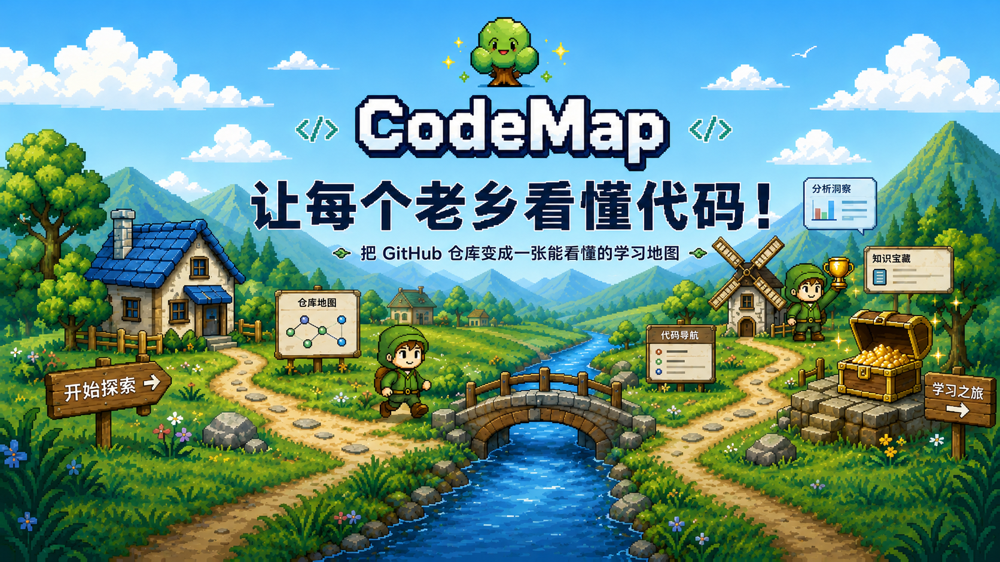
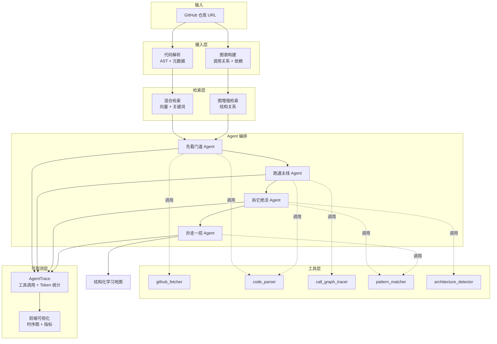
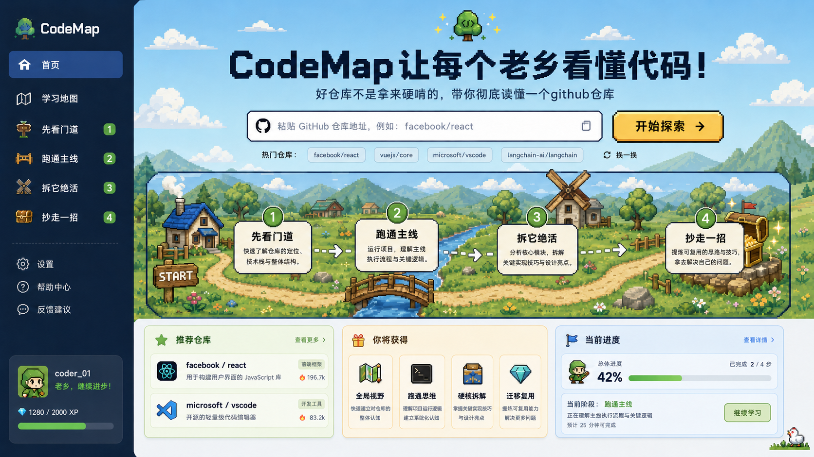

# CodeGraph

<div align="center">
  

  <h3>用多 Agent 协作，把复杂仓库拆成一条能走完的学习路径</h3>

  <p>
    <a href="./README.md">English</a> · <a href="./README.zh.md">中文</a> · <a href="https://code-graph-five.vercel.app/" target="_blank">在线 Demo</a>
  </p>

  <p>
    
    
    
    
    
    
  </p>
</div>

---

## 你是不是也这样？

你想学习 `React`、`Vue`、`LangChain` 这些优秀开源项目，想理解它们的设计思想、实现技巧。

然后打开仓库，几千个文件扑面而来：

- 入口在哪？第一个该看哪个文件？
- 主流程是怎么跑起来的？
- 哪些模块是真的核心，哪些只是边角料？
- 这个项目的设计精髓在哪，有什么值得学到自己项目里的？
- 我要怎么从"看不懂"走到"真正理解"？

于是你收藏夹里躺着几十个仓库，真正读完的不到十分之一。看了一堆源码解析文章，换个项目又迷路。问 AI 一堆零碎问题，答案看着有用，但始终缺一张**全局地图**。

**CodeGraph 想解决的就是这件事：让一组 AI Agent 替你完成一次有章法、可追溯的源码理解，最后给你一张能走完的学习路径。**

---

## CodeGraph 是什么

CodeGraph 不是又一个"代码问答机器人"，而是一个**多 Agent 协作编排系统**。

它的核心思路是：**读懂一个仓库不是一次问答能搞定的，而是一个分阶段、层层递进的过程。** 所以 CodeGraph 让四个各司其职的 Agent 依次接力，每个 Agent 解决一个阶段的问题，并把成果交给下一个：

| 阶段 Agent | 它帮你回答 | 你会得到 |
|-----------|-----------|---------|
| **① 先看门道**（OverviewAgent） | 这项目到底是干嘛的？怎么组织的？ | 一句话定位、技术栈、架构总览、推荐阅读顺序 |
| **② 跑通主线**（MainFlowAgent） | 主流程是怎么跑起来的？ | 入口文件、调用链、关键逻辑、可点击的执行路径图 |
| **③ 拆它绝活**（ShowcaseAgent） | 这项目有哪些值得学的设计？ | 3 个设计亮点：问题 / 方案 / 取舍 / 代码证据 |
| **④ 抄走一招**（TakeawayAgent） | 我能把什么搬进自己的项目？ | 3 个可复用模式 + 实现片段 + 适用场景 |

每个 Agent 都用**确定性工具**（AST 解析、调用链追踪、依赖分析）打底，再用 **LLM 做综合判断**。所有工具调用和 LLM 交互都有完整 trace 记录。

> 🎯 **[在线 Demo 体验](https://code-graph-five.vercel.app/)** —— 当前线上 Demo 展示的是前端学习地图交互层；完整的 Agent 工作流和图增强检索运行在后端（需要本地启动）。这点我如实说明，不夸大。

---

## 它和普通 RAG 有什么不一样

很多代码理解工具是这么做的：

**做法一：传统 RAG**
```
切代码块 → 向量化 → 召回相似片段 → 生成回答
```
问题：丢掉了代码结构。它不理解调用链、模块边界、架构模式，只能回答"局部相似"的问题。

**做法二：通用聊天机器人**
```
塞入仓库上下文 → 你问它答 → 得到回答
```
问题：没有系统性分析。答案是被动的、零散的，没有从"这是什么"到"怎么用"的递进。

**CodeGraph 的做法：多 Agent 编排**
```
先看门道 → 跑通主线 → 拆它绝活 → 抄走一招
（每个 Agent 用工具 + 上一阶段的产出）
```

| 能力 | 传统 RAG | 聊天机器人 | CodeGraph |
|------|---------|-----------|-----------|
| 系统化仓库分析 | ❌ | ❌ | ✅ 四阶段工作流 |
| 调用链追踪 | ❌ | ⚠️ 看 prompt 发挥 | ✅ 专用工具 + Agent |
| 结构化输出 | ⚠️ 可加 schema | ❌ 自由文本 | ✅ JSON Schema 约束 |
| Agent 职责分工 | ❌ 单模型 | ❌ 单模型 | ✅ 4 个专职 Agent |
| 全链路可观测 | ❌ | ❌ | ✅ 工具 trace + token 统计 |
| 图增强检索 | ❌ 仅向量 | ❌ 仅上下文 | ✅ 向量 + 代码关系 |

**关键认知**：理解代码库不是单轮问答，而是一个多阶段工作流——每一阶段都建立在上一阶段之上。这正是多 Agent 编排能做、单个聊天机器人做不到的事。

---

## 架构设计



**核心设计决策：**

- **Agent 职责分离**：每个 Agent 只负责一个理解阶段（总览 → 流程 → 亮点 → 迁移），而不是泛泛的"回答任何问题"。
- **工具化执行**：Agent 不把分析逻辑硬编码在 prompt 里，而是组合调用注册好的工具（`call_graph_tracer`、`pattern_matcher` 等）。
- **图增强检索**：不只看语义相似度，还看代码结构（import、调用、继承关系）——不是纯向量 RAG。
- **默认可观测**：每次 `call_tool()` 和 `call_llm()` 都自动记录 trace（参数、结果、耗时、token）。前端实时展示 Agent 执行时序图。

---

## 这套东西对你有什么用？

### 如果你想学习优秀项目

- **系统化读懂大型仓库**：不再盲目从 README 点进去乱翻，Agent 帮你拆成"总览 → 主线 → 亮点 → 迁移"四步，一步步走完。
- **理解设计思想，而非死记代码**：想搞懂某个框架/库为什么这么设计、核心实现技巧在哪，Agent 把架构、流程、设计取舍讲清楚。
- **提炼可迁移的能力**：从优秀项目学到状态管理、中间件链、插件系统等可复用模式，搬进自己的项目，而不是看完就忘。

### 如果你是开发者

- **技术选型参考**：评估一个库是否适合你的项目，Agent 帮你快速抽取架构、流程、设计 tradeoff。
- **提升源码阅读效率**：换个新项目不再从零迷路，有一条清晰的学习路径可以跟着走。
- **顺便对技术面试也有帮助**：当被问到"读过哪些优秀源码"，你能把一个项目从架构到设计亮点讲得有条理。

### 如果你在做 Agent 相关项目

- **Multi-Agent 参考实现**：完整的 Agent 编排、工具调用、trace 记录、前端可视化，可以拿去参考或二次开发。
- **Graph-Enhanced RAG 实践**：不只有向量检索，还有代码关系图谱增强，适合代码理解场景。

---

## 技术栈

| 层级 | 技术 |
|------|------|
| **前端** | React、TypeScript、Vite、Mantine UI、像素风设计系统 |
| **后端** | FastAPI、Python 3.11、全异步 async/await |
| **Agent 系统** | 自定义编排器、`BaseAgent` 抽象、工具注册机制 |
| **检索** | 混合检索（向量 + 关键词）、图增强排序 |
| **图谱** | 代码关系建模（调用、import、依赖） |
| **解析** | Tree-sitter 多语言 AST 解析 |
| **LLM** | OpenAI 兼容 API（可配置 GPT-4、DeepSeek 等） |
| **可观测** | `AgentTrace`、`ToolCall` 日志、前端可视化 |
| **部署** | Docker Compose（本地基础设施）、Vercel（前端） |

---

## 效果预览

### 首页



### 学习地图


### 四个阶段页面

<table>
  <tr>
    <td width="50%">
      
      <p align="center"><strong>① 先看门道</strong> — 项目定位、架构、心智模型</p>
    </td>
    <td width="50%">
      
      <p align="center"><strong>② 跑通主线</strong> — 执行路径和调用链</p>
    </td>
  </tr>
  <tr>
    <td width="50%">
      
      <p align="center"><strong>③ 拆它绝活</strong> — 设计亮点和模式</p>
    </td>
    <td width="50%">
      
      <p align="center"><strong>④ 抄走一招</strong> — 可复用模式和代码模板</p>
    </td>
  </tr>
</table>

---

## 快速开始

### 环境要求

- Python 3.11+
- Node.js 18+
- Docker 和 Docker Compose
- OpenAI 兼容模型 API Key

### 1. 克隆仓库

```bash
git clone https://github.com/liu66-qing/CodeGraph.git
cd CodeGraph
```

### 2. 配置环境变量

```bash
cp .env.example .env
```

编辑 `.env`，填入你的 API key 和服务配置：

```env
# LLM 配置
OPENAI_API_KEY=your_api_key_here
OPENAI_BASE_URL=https://api.openai.com/v1  # 或 DeepSeek 等

# 数据库和缓存
NEO4J_URI=bolt://localhost:7687
REDIS_URL=redis://localhost:6379
```

### 3. 启动基础服务

```bash
docker-compose up -d
```

这会启动 Neo4j（图数据库）和 Redis（缓存）。

### 4. 启动后端

```bash
pip install -e ".[dev]"
uvicorn codegraph.main:app --reload --host 0.0.0.0 --port 8000
```

后端运行在 `http://localhost:8000`，API 文档在 `http://localhost:8000/docs`。

### 5. 启动前端

```bash
cd frontend
npm install
npm run dev
```

前端运行在 `http://localhost:5173`。

---

## 项目结构

```
.
├── frontend/                  # React + Vite 前端
│   ├── src/
│   │   ├── components/        # 可复用 UI 组件
│   │   ├── pages/             # 4 个阶段页 + 首页 + 学习地图
│   │   ├── i18n/              # 中英文语言字典
│   │   └── assets/pixel/      # 像素风设计素材
├── src/codegraph/             # Python 后端
│   ├── agent/
│   │   ├── base.py            # BaseAgent、AgentTrace、ToolCall
│   │   ├── stages/            # OverviewAgent、MainFlowAgent 等
│   │   ├── tools/             # github_fetcher、code_parser 等
│   │   └── orchestrator.py    # Agent 协调逻辑
│   ├── retrieval/             # 混合检索 + 图增强
│   ├── graph/                 # 代码关系建模
│   ├── parsers/               # Tree-sitter AST 解析
│   └── main.py                # FastAPI 应用入口
├── tests/                     # 单元测试和集成测试
├── docs/                      # 设计文档、PRD、截图
└── docker-compose.yml         # 本地基础设施
```

---

## 路线图

- [ ] 增强大型 TypeScript/Python 仓库的调用链准确性
- [ ] 跨文件模式检测（如中间件链跨多个文件的识别）
- [ ] 集成 GitHub issue/PR 上下文分析
- [ ] 导出学习地图为 Markdown 或 PDF
- [ ] 部署完整后端，提供端到端在线 Demo
- [ ] 为热门仓库提供分析样例（React、FastAPI、LangChain 等）

---

## 如何参与

CodeGraph 还在早期，欢迎任何形式的参与。

**你可以这样帮忙：**

- ⭐ **给个 Star** — 如果多 Agent 这个思路让你觉得有意思
- 🐛 **提 Issue** — 告诉我哪些仓库分析效果不好，或者遇到了 bug
- 💡 **提建议** — Agent 的 prompt、工具、架构都可以改进
- 🔧 **提 PR** — 新增语言解析器、分析工具、UI 改进都欢迎

**适合入手的 Issue：**

- 支持 Rust/Go/Java 的 AST 解析
- 改进异步调用密集型代码的流程提取
- 为某个热门仓库添加分析样例（Next.js、Vue 等）
- 导出 Agent 分析结果为结构化 Markdown

---

## 开源协议

Apache-2.0，详见 [LICENSE](./LICENSE)。

---

<div align="center">
  <strong>如果 CodeGraph 帮你读懂了一个复杂仓库，欢迎给个 Star ⭐</strong>
  <br>
  <sub>Star 的数量会直接影响这个项目接下来做什么、做多深。</sub>
</div>


