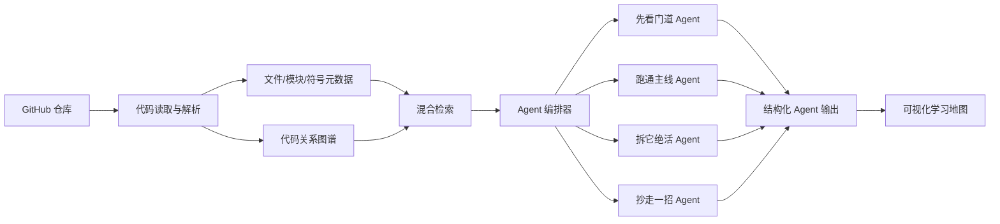

# CodeGraph

<div align="center">
  

  <h3>一个面向 GitHub 仓库理解的 Agentic RAG 项目：会规划、会检索、会拆解、会生成源码学习地图。</h3>

  <p>
    <a href="./README.md">English</a> ·
    <a href="https://code-graph-five.vercel.app/">在线 Demo</a> ·
    <a href="https://code-graph-five.vercel.app/map">学习地图</a> ·
    <a href="#如何参与">参与共建</a>
  </p>

  <p>
    
    
    
    
    
    
  </p>
</div>

## 你是不是也这样读源码？

你想学习 `React`、`Vue`、`VS Code`、`LangChain` 这种优秀项目。

然后打开仓库，几千个文件扑面而来。

README 告诉你怎么安装、怎么用，但没人告诉你：

- 第一个应该看哪个文件？
- 主流程从哪里开始跑？
- 哪些模块是真的核心？
- 哪些设计值得抄到自己的项目里？
- 我要怎么从“看不懂”走到“能提 PR”？

结果往往是：

- 收藏了很多仓库，但真正读完的不多。
- 看了很多源码解析文章，但换个项目又迷路。
- 问 AI 一堆问题，答案看似有用，最后还是缺一张全局地图。

**CodeGraph 想解决的就是这个痛点：用 Agent 编排和图增强检索，把复杂 GitHub 仓库拆成可追踪、可解释、可继续推进的结构化理解结果。**

如果你也觉得“读懂优秀项目”这件事应该变得更简单，欢迎给这个仓库点个 Star。Star 是我继续把它做下去的最大动力。

## CodeGraph 是什么？

CodeGraph 是一个面向代码仓库理解的 Agentic RAG 项目。

它不是单纯的“代码问答机器人”，也不只是一个可视化页面。它的核心是让多个阶段化 Agent 围绕同一个仓库协作分析：先建立全局结构，再追踪主流程，再提炼实现亮点，最后生成可复用的学习结论。

| Agent 阶段 | 解决的问题 | 你会得到什么 |
| --- | --- | --- |
| **1. 先看门道** | 这个项目到底是干什么的？结构怎么分？ | 项目定位、技术栈、目录结构、核心模块 |
| **2. 跑通主线** | 项目的主流程怎么跑起来？ | 入口文件、调用链、关键逻辑、执行路径 |
| **3. 拆它绝活** | 这个项目有哪些值得学的设计？ | 抽象方式、实现技巧、工程取舍、亮点模块 |
| **4. 抄走一招** | 我能把什么迁移到自己的项目？ | 可复用方法、实践卡片、改造建议 |

一句话：

> CodeGraph 不是帮你“搜答案”，而是让 Agent 替你完成一次有结构的仓库理解流程。

## 在线体验

- [在线 Demo](https://code-graph-five.vercel.app/)
- [学习地图页](https://code-graph-five.vercel.app/map)

说明：当前在线 Demo 主要展示产品交互层；完整 Agent 工作流、图增强召回、仓库分析和结构化输出需要在本地启动后端服务。

## 效果预览

### 真实学习路径页


### 首页与四阶段页面

<table>
  <tr>
    <td width="50%">
      
      <p align="center"><strong>首页：输入仓库，开始探索</strong></p>
    </td>
    <td width="50%">
      
      <p align="center"><strong>学习地图：四阶段路线</strong></p>
    </td>
  </tr>
  <tr>
    <td width="50%">
      
      <p align="center"><strong>先看门道</strong></p>
    </td>
    <td width="50%">
      
      <p align="center"><strong>跑通主线</strong></p>
    </td>
  </tr>
  <tr>
    <td width="50%">
      
      <p align="center"><strong>拆它绝活</strong></p>
    </td>
    <td width="50%">
      
      <p align="center"><strong>抄走一招</strong></p>
    </td>
  </tr>
</table>

## 为什么不是普通 RAG？

很多代码 RAG 项目做的是：

```text
切代码块 -> 向量化 -> 相似度召回 -> 生成回答
```

这能回答局部问题，但很难帮你建立全局理解。

源码不是普通文本。源码有入口、模块、依赖、调用链、测试、抽象边界。

CodeGraph 更像一个围绕代码结构工作的 Agent 系统：

- **图增强检索**：不只看语义相似，还看代码实体之间的关系。
- **阶段化 Agent**：总览、主线、亮点、迁移建议分别由不同阶段承接。
- **工具化分析链路**：代码读取、结构解析、检索、推理和输出拆成可组合步骤。
- **结构化输出**：不是生成一段泛泛解释，而是输出地图、流程、亮点和可迁移结论。
- **可视化 Agent UI**：学习地图是 Agent 分析结果的展示界面，不是项目的全部。

## 架构概览



## 技术栈

| 层 | 技术 |
| --- | --- |
| 前端 | React、TypeScript、Vite、Mantine、像素风 UI |
| 后端 | FastAPI、Python 3.11 |
| 检索 | 向量检索、关键词检索、混合召回 |
| 图谱 | 面向代码关系的图结构建模 |
| Agent | Agent 编排器、阶段化分析 Agent、工具调用、结构化输出 |
| 部署 | Docker Compose、本地后端、Vercel 前端 |

## 快速开始

### 环境要求

- Python 3.11+
- Node.js 18+
- Docker 和 Docker Compose
- OpenAI 兼容模型 API Key

### 克隆项目

```bash
git clone https://github.com/liu66-qing/CodeGraph.git
cd CodeGraph
```

### 配置环境变量

```bash
cp .env.example .env
```

编辑 `.env`，填入模型、数据库、缓存等配置。

### 启动基础服务

```bash
docker-compose up -d
```

### 启动后端

```bash
pip install -e ".[dev]"
uvicorn evograph.main:app --reload --host 0.0.0.0 --port 8000
```

### 启动前端

```bash
cd frontend
npm install
npm run dev
```

访问 `http://localhost:5173`。

## 适合谁？

- 想读懂优秀开源项目，但经常卡在文件树里的开发者
- 想为团队新人做项目 onboarding 的技术负责人
- 想做 Code Agent / Agentic RAG / 图谱检索项目的同学
- 想给开源项目提 PR，但不知道从哪里理解代码的人
- 想研究 Agentic RAG 在代码理解场景中怎么落地的人

## 路线图

- [ ] 支持更多 TypeScript / Python 项目结构
- [ ] 增强调用链和模块依赖分析
- [ ] 接入 GitHub issue / PR 背景理解
- [ ] 导出 Markdown / PDF 学习报告
- [ ] 部署完整后端，提供端到端在线体验
- [ ] 增加更多真实开源项目分析样例

## 如何参与

现在项目还在早期，最需要真实反馈。

你可以这样参与：

- 给仓库点 Star，让更多人看到这个项目。
- 提 Issue：告诉我你最想分析哪个仓库。
- 提建议：你希望“代码仓库理解 Agent”应该具备什么能力。
- 提 PR：增加新的语言解析、新的分析器、新的页面或文档。

适合作为 Issue 的想法：

- 支持 Next.js App Router 项目分析
- 支持 FastAPI 项目的主流程提取
- 增加 LangChain 仓库分析样例
- 导出学习路径为 Markdown
- 增加 GitHub issue 背景分析

## License

Apache-2.0，详见 [LICENSE](./LICENSE)。

---

<div align="center">
  <strong>如果 CodeGraph 让你觉得“读源码可以不那么痛苦”，欢迎点一个 Star。</strong>
  <br>
  Star、Issue 和 PR 都会直接影响这个项目下一步做什么。
</div>
