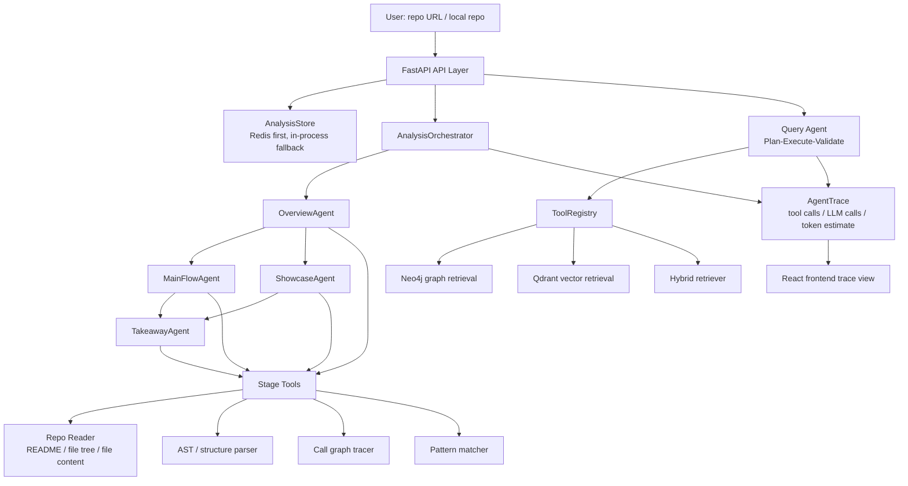

# CodeMap Agent Architecture

本文档的目标不是把所有热门 Agent 概念都贴到项目上，而是说明 CodeMap 作为“帮助开发者理解陌生代码仓库”的 Agent 产品，哪些架构能力已经实现，为什么需要它们，以及哪些能力应该作为下一阶段演进。

面试中最容易被质疑的是“为了显得像 Agent 而强行加模块”。所以本文采用一个原则：

> 只把能服务代码理解流程的能力放进主架构；暂未完整实现的能力明确标成 Roadmap，不把规划说成现状。

---

## 1. 产品定位

CodeMap 的核心任务不是通用聊天，而是把一个陌生代码仓库转换成可学习、可追踪、可复盘的理解路径。

典型用户流程：

1. 用户提交 GitHub 仓库 URL 或本地仓库路径。
2. 系统读取 README、目录、源码结构、调用关系和设计模式信号。
3. 四阶段 Agent 生成结构化学习结果：
   - `OverviewAgent`：这个仓库是什么，先读哪里。
   - `MainFlowAgent`：主流程从入口到核心逻辑怎么跑。
   - `ShowcaseAgent`：有哪些值得学习的设计亮点。
   - `TakeawayAgent`：哪些模式可以迁移到自己的项目。
4. 前端展示学习地图、主线流程、设计亮点、可复用模式和 Agent trace。
5. `evals/` 用固定小仓库评估输出是否完整、是否有源码依据、是否覆盖关键架构概念、trace 是否健康。

这决定了 CodeMap 的 Agent 架构更像“代码理解工作流 Agent”，不是 AutoGPT 式开放世界 Agent。

---

## 2. 架构取舍：哪些该留，哪些该降级

判断一个 Agent 设计是否画蛇添足，只看一个问题：

> 如果删掉它，用户读懂仓库的效果、稳定性、可验证性会不会明显变差？

按这个标准，CodeMap 的设计分三类。

### 2.1 核心能力：必须保留

| 能力 | 是否画蛇添足 | 原因 |
| --- | --- | --- |
| 四阶段 Pipeline | 否 | 代码理解天然有认知顺序：先总览、再主线、再亮点、最后迁移。固定 DAG 比开放式 Agent 更稳定。 |
| 确定性工具调用 | 否 | README、目录、AST、调用链、设计模式检测都必须来自真实代码，不能只靠 LLM 猜。 |
| Repo-level 长期记忆 | 否 | 产品要反复回答“这个仓库里谁调用谁、模块怎么组织”，需要保存代码关系和分析产物。 |
| Trace / tool stats / evals | 否 | 面试和真实产品都需要证明 Agent 不是只会生成漂亮文本，而是可观察、可回归。 |
| 轻量人机确认 | 否 | 当前系统有删除、重置等管理操作，typed confirmation 是真实风险边界，不是装饰。 |

### 2.2 辅助能力：可以有，但不能放在主链路

| 能力 | 风险 | 正确位置 |
| --- | --- | --- |
| ReAct | 如果作为主架构，会显得为了 Agent 而 Agent | 只用于自由探索式问答；仓库分析主流程不用它 |
| Plan-Execute | 对固定 4-stage 分析不是必要 | 用于用户自由问答、影响分析、跨工具检索 |
| Session Memory | 如果讲成复杂用户画像，会过度设计 | 只保存当前 repo、最近问题、entity focus、阅读进度 |
| Vector Store | 如果所有场景都上向量检索，会稀释代码结构优势 | 用于语义问答；调用关系和影响分析优先走图/AST |
| Repo Wiki / LLM-Wiki | 如果单独造概念会像追热点 | 作为 module cards、symbol cards、架构摘要的持久化索引层 |

### 2.3 暂缓能力：现在不该做主设计

| 能力 | 为什么暂缓 |
| --- | --- |
| Skill Marketplace | 当前没有外部开发者贡献 skill 的场景。先把内置代码理解能力做好。 |
| 复杂用户长期画像 | CodeMap 的核心对象是 repo，不是用户人格。用户偏好可以后置。 |
| 多模型路由 | 成本优化有价值，但不是 3 天内最能证明 Agent 能力的部分。 |
| 分布式多 Agent | 大仓库会需要，但当前项目先证明单仓库分析闭环。 |
| 全自动写代码/改代码 | 产品定位是理解仓库，不是修改仓库。强行加入会扩大安全风险。 |

因此，最终主架构应该收敛为：

```text
Repo Understanding Pipeline
  = deterministic code tools
  + staged LLM synthesis
  + repo-level memory/wiki
  + trace/evals
  + lightweight human guardrails
```

而不是：

```text
Generic Agent Platform
  = ReAct + skills marketplace + user memory + every fashionable component
```

---

## 3. 总体架构



项目里目前有两条 Agent 执行路径：

| 路径 | 代码入口 | 适用场景 | 状态 |
| --- | --- | --- | --- |
| 四阶段仓库分析 | `src/codegraph/agent/analysis_orchestrator.py` | 输入一个仓库，生成学习路径 | 主产品路径，已接 API 和前端 |
| 问答式 Plan-Execute | `src/codegraph/agent/orchestrator.py`、`planner.py`、`engine.py` | 用户围绕知识图谱/代码图谱自由提问 | 已实现核心循环，部分依赖外部存储数据 |

面试表达建议：

> 我没有把所有问题都交给一个通用 Agent，而是把“读懂仓库”拆成固定阶段。这是因为代码理解有稳定认知顺序：先总览，再主线，再亮点，最后迁移。对于自由问答，再使用 Plan-Execute 或 ReAct。

---

## 4. 记忆方案

面试官提到的短期记忆、长期记忆、记忆存储选型，在 CodeMap 中应该这样解释。

### 4.1 记忆分层

| 记忆类型 | 当前实现 | 存储选型 | 用途 | 风险说明 |
| --- | --- | --- | --- | --- |
| Working Memory | `WorkingMemory` dataclass；四阶段 context dict；`working_memory` list | 进程内内存 | 单次任务内保存问题、证据、步骤、阶段输出 | 任务结束后不持久 |
| Session Memory | `SessionMemory` in-memory dict | 进程内 dict | 多轮对话的最近问题、实体焦点、简单指代消解 | 单进程可用，多实例/重启会丢 |
| Long-Term Memory | Neo4j、Qdrant、Redis、AnalysisStore | Neo4j/Qdrant/Redis | 存代码关系、语义片段、分析任务结果 | Postgres 目前主要是配置，未成为核心存储 |

对应代码：

- `src/codegraph/agent/engine.py`：`WorkingMemory`
- `src/codegraph/agent/memory.py`：`SessionMemory`
- `src/codegraph/agent/analysis_store.py`：分析任务状态存储
- `src/codegraph/graph/neo4j_client.py`：图存储
- `src/codegraph/storage/vector_store.py`：向量存储
- `src/codegraph/storage/redis_cache.py`：Redis 缓存

### 4.2 短期记忆为什么用内存

短期记忆服务单次 Agent run，读写频繁，生命周期短。用内存有三个好处：

1. 无网络开销，适合每轮工具调用后立刻构造上下文。
2. 数据结构灵活，方便保存 tool result、trace、阶段输出。
3. 与当前单进程 demo/面试部署匹配。

这不是说 Redis 不重要，而是 Redis 更适合跨请求、跨进程的 session/task 状态，不适合每一步推理的 hot path。

### 4.3 长期记忆为什么不是“用户画像优先”

CodeMap 的长期记忆核心不是用户偏好，而是代码库知识：

- 函数、类、模块、文件关系。
- 调用、依赖、导入、演化、破坏性变更。
- README、代码片段、分析结果。

原因是产品目标是“理解代码仓库”，不是“陪伴式个人助手”。如果强行加用户长期画像，会显得为了 Agent 概念而加。更合理的长期记忆路线是：

1. 先持久化 repo-level knowledge。
2. 再持久化 session-level reading progress。
3. 最后才考虑 user preference，例如用户偏好“先看 API 层”还是“先看数据流”。

### 4.4 下一步该补的记忆能力

如果只从面试官的关键词看，最容易想补的是 Redis-backed SessionMemory。但从产品价值看，优先级应该是：

1. Repo-level memory/wiki：让同一个仓库的模块卡片、符号卡片、架构摘要可复用。
2. Lightweight SessionMemory：保存当前 repo、最近问题、entity focus、阅读进度。
3. User preference memory：最后再做，例如用户偏好“先看 API 层”还是“先看数据流”。

Redis-backed SessionMemory 的合理边界是：

- key：`codemap:session:{session_id}`
- TTL：7 天
- 内容：最近 N 轮问答摘要、当前 repo_id、entity_focus、reading_progress
- 价值：服务重启不丢会话，多实例部署可共享状态

这比做复杂用户画像更贴合产品。

---

## 5. 工具加载与调用

CodeMap 当前有两套工具体系，它们不是重复，而是服务两种执行模式。

### 5.1 Stage Tools：确定性工作流工具

代码位置：`src/codegraph/agent/tools/__init__.py`

四阶段 Agent 使用 `STAGE_TOOLS`：

- `fetch_repo_tree`
- `fetch_readme`
- `fetch_file_content`
- `parse_code_structure`
- `trace_call_graph`
- `detect_architecture`
- `match_patterns`
- `resolve_dependencies`

调用方式：

```python
tree = await self.call_tool("fetch_repo_tree", repo_url=repo_url)
```

特点：

- Agent 知道当前阶段需要哪些工具。
- 工具调用由代码编排，不让 LLM 随意选择。
- 每次 `call_tool()` 自动写入 `AgentTrace`。

这适合“读懂仓库”这种稳定流程。

### 5.2 ToolRegistry：问答式动态工具

代码位置：`src/codegraph/agent/tools/registry.py`

`ToolRegistry` 面向自由问答和 Plan-Execute：

- `graph_query`
- `vector_search`
- `hybrid_search`
- `find_callers`
- `find_dependencies`
- `analyze_impact`
- `explain_symbol`
- `feature_evolution`

调用方式：

```python
result = await tool_registry.execute(step.tool, step.input_params)
```

特点：

- Planner 先把问题拆成 step。
- Executor 根据 step 调用工具。
- Synthesizer 基于 evidence 生成答案。
- Validator 检查答案是否被证据支撑。

这适合用户问“谁调用了这个函数”“改这里影响哪里”“这个模块为什么这么设计”。

### 5.3 不应夸大的点

当前代码中有 OpenAI function calling 风格的 `TOOLS_SCHEMA`，但主产品路径并不依赖 LLM 自主选择任意工具。面试中更稳妥的说法是：

> 我保留了 ReAct/function-calling 的执行引擎，但仓库分析主流程采用确定性工具编排。这样可控性更强，也更容易做评估和 trace。

---

## 6. ReAct 与 Plan-Execute

面试官提到 ReAct 模式和 Plan-Exec 模式，CodeMap 中都可以讲，但要区分主次。

### 6.1 ReAct 模式

代码位置：`src/codegraph/agent/engine.py`

核心循环：

```text
LLM observes question/context
-> selects tool call
-> tool result appended to messages
-> LLM decides next action
-> stop at final answer / iteration cap / token cap
```

适用场景：

- 单轮探索式问题。
- 工具选择不确定的问题。
- 需要边观察边决定下一步的问题。

当前保护：

- `max_iterations = 5`
- `token_budget = 50000`
- tool output 截断到约 2000 chars
- `state_history` 记录状态转换

### 6.2 Plan-Execute 模式

代码位置：

- `src/codegraph/agent/planner.py`
- `src/codegraph/agent/orchestrator.py`

流程：

```text
Question
-> Planner decomposes steps
-> ToolRegistry executes steps
-> Evidence working memory
-> Synthesizer
-> Validator
-> Re-plan if validation fails
```

适用场景：

- 影响分析。
- 架构解释。
- 需要多种检索组合的问题。
- 需要验证答案是否有证据支撑的问题。

### 6.3 四阶段 Pipeline 与 Plan-Execute 的关系

四阶段 Pipeline 不是为了追热点，而是产品主流程：

```text
Overview -> MainFlow + Showcase -> Takeaway
```

它本质上是一个固定 DAG，因为“读懂仓库”的认知路径稳定。

Plan-Execute 则用于自由问答，因为用户问题不可预测。

面试表达建议：

> 我没有强行统一成一种 Agent 模式。固定产品流程用 DAG pipeline，保证输出稳定；开放问题用 Plan-Execute；探索式问题保留 ReAct。选择执行模式是由任务不确定性决定的。

---

## 7. 长上下文压缩策略

CodeMap 的长上下文问题来自代码仓库：文件多、README 长、调用链长、工具结果大。

当前已经实现的压缩/裁剪：

| 场景 | 策略 | 代码位置 |
| --- | --- | --- |
| 工具结果进 trace | `_preview(..., max_chars=400)` | `agent/base.py` |
| 工具结果进 LLM messages | 截断到约 2000 chars | `agent/engine.py` |
| Overview 解析文件 | 只取前 25 个代码文件 | `overview_agent.py` |
| Showcase 读取文件 | 只取前 15 个文件，每个约 3000 chars | `showcase_agent.py` |
| MainFlow 读取关键文件 | 只取 call graph key files 前 5 个 | `mainflow_agent.py` |
| Query evidence | 只拼接前若干 chunks/facts | `agent/orchestrator.py` |

这些策略比较朴素，但符合当前产品阶段：先保证不会 context overflow，再逐步做更聪明的压缩。

下一步更贴合产品的压缩策略：

1. Repo Map：先生成模块级摘要，再按问题选择相关模块。
2. Symbol Card：为函数/类保存签名、docstring、调用边、简短摘要。
3. Trace Compaction：长 trace 只保留失败步骤、关键工具调用、最终证据。
4. Progressive Reading：用户点进某个模块时再展开源码，不一次性塞满上下文。

不建议现在强行写成“已有成熟 memory consolidation”，否则容易被追问实现在哪里。

---

## 8. 会话管理机制

当前会话管理分两层：

### 8.1 分析任务会话

代码位置：`src/codegraph/api/v1/analysis.py`

用户提交仓库后，系统生成 `task_id`：

```text
POST /api/v1/analysis/repos/analyze -> task_id
GET /api/v1/analysis/repos/{task_id}/status
GET /api/v1/analysis/repos/{task_id}/traces
```

任务状态通过 `AnalysisStore` 保存：

- Redis 可用时写 Redis。
- Redis 不可用时退回进程内 dict。
- TTL 为 7 天。

这是面试中最该强调的会话机制，因为它直接服务“仓库分析任务”。

### 8.2 问答会话

代码位置：`src/codegraph/agent/memory.py`

`SessionMemory` 保存：

- `conversation_history`
- `entity_focus`
- 最近实体
- 简单指代消解

现状限制：

- 进程内存储。
- 中文 pronoun 规则目前有编码问题，需要修复。
- 还没有接完整用户账号体系。

下一步应该改成 Redis + TTL，而不是直接上复杂数据库。

---

## 9. LLM-Wiki 与 Skill

面试官提到 llm-wiki、skill，这两个概念可以讲，但要贴合 CodeMap。

### 9.1 LLM-Wiki 在 CodeMap 中应该是什么

不要把 llm-wiki 讲成外部知识百科。对 CodeMap 来说，更自然的是“repo wiki”：

```text
Repository
-> module cards
-> symbol cards
-> architecture summary
-> main flow summary
-> design highlight notes
-> reusable pattern notes
```

它是一份面向 LLM 和用户共同使用的代码库知识索引。

当前已有基础：

- 架构分析器：`agent/analyzers/architecture_analyzer.py`
- 模块卡片：`agent/analyzers/module_cards.py`
- 学习路径：`agent/analyzers/learning_path.py`
- 符号解释：`agent/analyzers/symbol_explainer.py`
- 图谱视图：`agent/analyzers/graph_view.py`

更稳妥说法：

> 我没有单独做一个叫 llm-wiki 的模块，但项目里已经有 repo wiki 的雏形：模块卡片、符号解释、架构摘要、学习路径。下一步可以把这些结果持久化成面向 LLM 检索的 wiki layer。

### 9.2 Skill 在 CodeMap 中应该是什么

不要把 4 个 Agent 硬说成 marketplace skill。那样会显得把“阶段”重新命名成“技能”，没有新增产品价值。更合理的定义是：

> Skill 是一个可复用的代码理解能力单元，由 trigger、required tools、input schema、output schema 和 evaluation rubric 组成。

当前可以称为内置 skills：

| Skill | 当前实现 | 输入 | 输出 |
| --- | --- | --- | --- |
| Repo Overview | `OverviewAgent` | repo tree、README、AST signals | 定位、阅读顺序、架构摘要 |
| Main Flow Tracing | `MainFlowAgent` | entry points、call graph、key files | 主流程节点 |
| Design Highlight Mining | `ShowcaseAgent` | pattern matches、file snippets | 设计亮点 |
| Pattern Takeaway | `TakeawayAgent` | highlights | 可复用模式 |
| Symbol Explanation | `symbol_explainer.py` | symbol、repo_id | 符号解释 |
| Impact Analysis | `ToolRegistry._analyze_impact` | symbol、repo_id | 影响面 |

只有当系统出现“可插拔的代码理解能力”时，才值得做 skill registry：

```text
skill_id
description
input_schema
output_schema
required_tools
trigger_examples
eval_cases
```

所以当前结论是：内置 skills 可以作为抽象边界保留，Skill Marketplace 暂缓。

---

## 10. 可观测性

当前已实现：

- `BaseAgent.call_tool()` 自动记录 tool name、args、result preview、duration、error。
- `BaseAgent.call_llm()` 记录 prompt chars、response chars、token 估算、model、duration。
- `AnalysisOrchestrator` 返回四阶段 `_traces`。
- `tool_stats_collector` 统计工具调用次数、耗时、错误率、agent 使用分布。
- `evals/` 检查 trace health。

对应代码：

- `src/codegraph/agent/base.py`
- `src/codegraph/agent/tools/stats.py`
- `src/codegraph/api/v1/agent_stats.py`
- `evals/scoring.py`

当前限制：

- token 统计是估算，不是 provider 返回的真实 usage。
- trace 存储随分析结果保存，尚未独立接 OpenTelemetry 后端。
- 全链路 trace id 还可以进一步贯穿 API、Agent、Tool、LLM。

面试建议：

> 我把 trace 放在 Agent 基类层，而不是每个工具里手写日志。这样新增工具时不会漏埋点。

---

## 11. 人机协同与安全边界

当前已补：

- `ADMIN_API_KEY` 保护管理接口。
- 删除文档、重置工具统计需要 typed confirmation。
- 相关测试在 `tests/unit/test_api_security.py`。

这能覆盖当前真实高风险操作。

不要过度声称：

- 目前还没有“每个 Agent plan 都需要用户审批”的完整审批队列。
- 目前 Agent 主流程主要是读仓库，不会直接改用户代码，所以不需要像代码修改 Agent 那样每步确认。

下一步如果要体现 Human-in-the-loop，最贴合产品的是：

1. 在 Plan-Execute 问答中展示 plan。
2. 用户可以禁用某些高成本工具，例如全仓库 call graph。
3. 用户确认后再跑长耗时分析。

---

## 12. 哪些部分有“强行加”的风险

| 可能被质疑的说法 | 风险 | 建议改法 |
| --- | --- | --- |
| “我们有完整长期用户记忆” | 当前没有用户画像持久化 | 改成“长期记忆主要是 repo knowledge，用户长期偏好是 roadmap” |
| “Skill Marketplace” | 当前没有 marketplace | 改成“内置代码理解 skills，未来可 registry 化” |
| “完整 LLM-Wiki” | 当前是多个 analyzer，不是独立 wiki 层 | 改成“repo wiki 雏形，下一步持久化为 wiki layer” |
| “成熟长上下文压缩” | 当前主要是截断和采样 | 改成“已有防溢出策略，下一步做 repo map/symbol card 压缩” |
| “完整多模态/多模型路由” | 代码里没有主路径实现 | 不放主架构，只放远期规划 |
| “所有工具由 LLM 自动选择” | 主 pipeline 是确定性工具编排 | 改成“双模式：pipeline 确定性调用，问答可动态规划” |

---

## 13. 下一阶段优先级

如果只有 3 天，建议顺序如下：

1. Repo Wiki Layer：把 module cards、symbol cards、architecture summary 持久化成可检索知识层。
2. Live LLM Evals：在 deterministic evals 之外增加真实模型评估模式。
3. Lightweight SessionMemory：保存当前 repo、最近问题、entity focus、阅读进度。
4. Plan Preview：长耗时/高成本分析前展示 plan，由用户确认。
5. Provider Token Usage：从 LLM response 中记录真实 token usage。

面试时不要说“全部已经做完”，而要说：

> 我把当前实现和下一阶段拆开讲。当前已经有主流程 Agent、工具调用、trace、evals、安全边界；下一步要补的是更产品化的 session memory、repo wiki 和 plan preview。

---

## 14. 关键文件索引

| 文件 | 职责 |
| --- | --- |
| `src/codegraph/agent/analysis_orchestrator.py` | 四阶段仓库分析 DAG |
| `src/codegraph/agent/stages/overview_agent.py` | 仓库定位、阅读顺序、架构摘要 |
| `src/codegraph/agent/stages/mainflow_agent.py` | 主流程追踪 |
| `src/codegraph/agent/stages/showcase_agent.py` | 设计亮点识别 |
| `src/codegraph/agent/stages/takeaway_agent.py` | 可复用模式提炼 |
| `src/codegraph/agent/base.py` | BaseAgent、ToolCall、LLMCall、AgentTrace |
| `src/codegraph/agent/engine.py` | ReAct/function-calling 执行引擎 |
| `src/codegraph/agent/planner.py` | Query planner |
| `src/codegraph/agent/orchestrator.py` | Plan-Execute-Validate 问答编排 |
| `src/codegraph/agent/tools/__init__.py` | 四阶段 Agent 工具集合 |
| `src/codegraph/agent/tools/registry.py` | 问答 Agent 工具注册表 |
| `src/codegraph/agent/memory.py` | 当前 SessionMemory |
| `src/codegraph/agent/analysis_store.py` | Redis-backed analysis task store |
| `evals/` | Agent 质量评估 |
